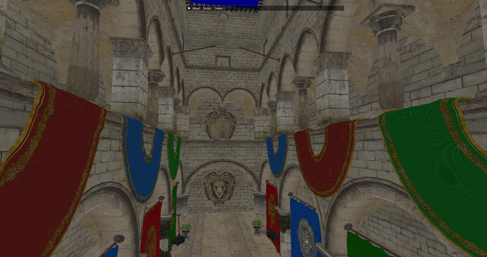

### Vulkan project to display node based scenes in GLTF

* full sponza scene (displaying albedo only)


* supports pbr data


### Building

#### Windows

1. Make sure you have Vulkan SDK and Visual Studio 2015 or up, then:
```
mkdir build
cd build
cmake-gui ..
```
2. And `Configure`(select `"Visual Studio 2015 x64"`), `Generate`, then you have Visual Studio project files.

3. Set `vulkan_gltf` as startup project and build solution


#### Linux
Make sure `VULKAN_SDK` is set to `x86_64` folder under Vulkan SDK path and you have `LD_LIBRARY_PATH` and `VK_LAYER_PATH` set by running `source ./setup-env.sh` at Vulkan SDK folder, and then
```
mkdir build
cd build
cmake ..
make
```
